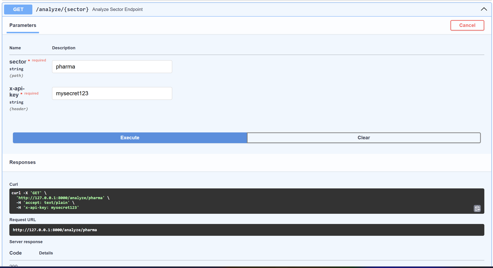
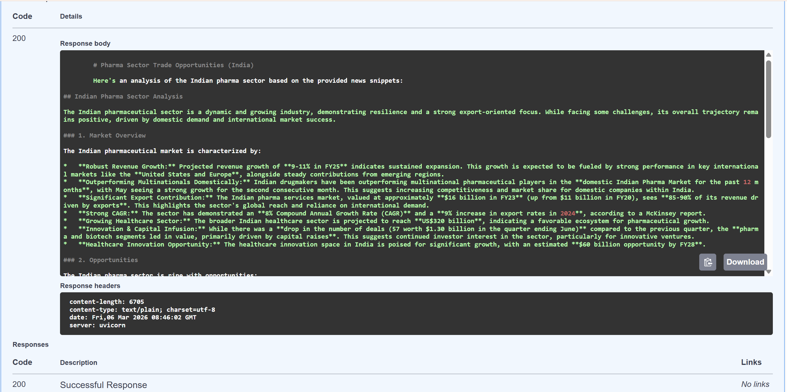
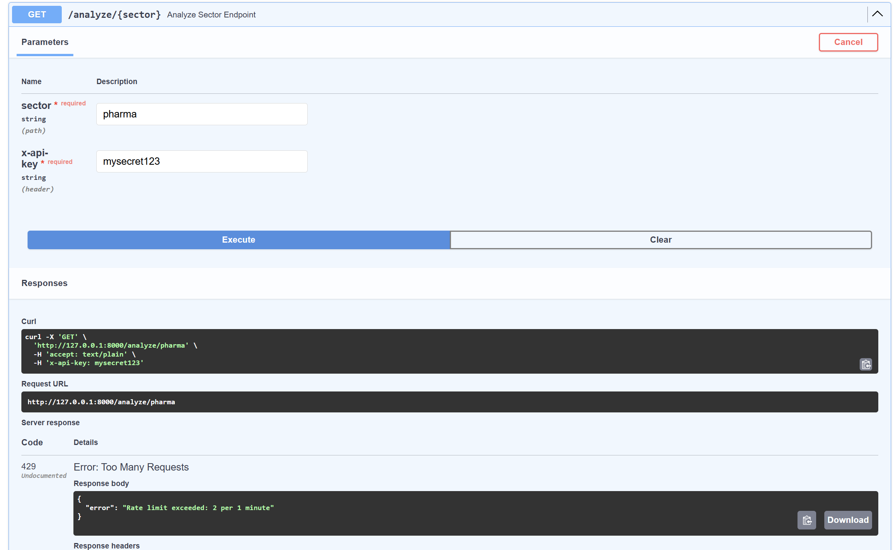

# Trade Opportunities API

A **FastAPI-based backend service** that analyzes Indian market sectors and generates **AI-powered trade opportunity reports** in Markdown format.

The system collects **current market news**, performs **AI-based analysis using Google Gemini**, and returns a **structured market insights report** for the requested sector.

This project demonstrates **modern backend engineering practices**, including API security, rate limiting, structured architecture, logging, and error handling.

---

# Project Overview

The API allows users to request a **market analysis for a specific sector** (e.g., pharmaceuticals, technology, agriculture).

It gathers recent market information from web search sources and uses **Gemini AI** to generate a structured report highlighting:

* Market overview
* Key trade opportunities
* Major companies
* Market risks
* Strategic insights

The result is returned as a **Markdown report** that can easily be saved as a `.md` file.

---

# Features

* FastAPI backend service
* AI-powered analysis using **Google Gemini**
* Market data collection via **web search**
* Structured **Markdown report generation**
* API key authentication
* Rate limiting per user
* Input validation
* Centralized logging
* Graceful error handling
* Clean modular architecture

---

# System Architecture

```
Client Request
      │
      ▼
FastAPI Endpoint (/analyze/{sector})
      │
      ▼
Service Layer
      │
      ├── Web Search Service
      │       (collects market news)
      │
      ├── AI Analysis Service
      │       (Gemini sector analysis)
      │
      └── Markdown Generator
              (builds structured report)
      │
      ▼
Markdown Response
```

---

# Project Structure

```
trade-opportunities-api
│
├── app
│   ├── api
│   │   └── routes.py
│   │
│   ├── services
│   │   ├── market_service.py
│   │   ├── ai_service.py
│   │   └── search_service.py
│   │
│   ├── security
│   │   ├── auth.py
│   │   └── rate_limiter.py
│   │
│   ├── middleware
│   │   └── logging.py
│   │
│   ├── utils
│   │   └── markdown.py
│   │
│   ├── config
│   │   └── settings.py
│   │
│   ├── models
│   │   └── request_models.py
│   │
│   └── main.py
│
├── docs
│   └── images
│       ├── swagger_output.png
│       └── rate_limit_error.png
│
├── tests
│   └── test_api.py
│
├── requirements.txt
├── .env
└── README.md
```

---

# Installation

### Clone the repository

```
git clone https://github.com/yourusername/trade-opportunities-api.git
cd trade-opportunities-api
```

### Create virtual environment

```
python -m venv venv
```

Activate environment

Windows:

```
venv\Scripts\activate
```

Linux / Mac:

```
source venv/bin/activate
```

---

### Install dependencies

```
pip install -r requirements.txt
```

---

# Environment Variables

Create a `.env` file in the root directory.

```
GEMINI_API_KEY=your_gemini_api_key
API_KEY=mysecret123
```

---

# Running the Application

Start the FastAPI server:

```
uvicorn app.main:app --reload
```

Server will start at:

```
http://127.0.0.1:8000
```

---

# API Documentation

FastAPI automatically provides interactive documentation.

Swagger UI:

```
http://127.0.0.1:8000/docs
```

---

# API Endpoint

## Analyze Sector

```
GET /analyze/{sector}
```

Example:

```
GET /analyze/pharmaceuticals
```

### Required Header

```
x-api-key: mysecret123
```

---

# Example Request

```
curl -H "x-api-key: mysecret123" \
http://127.0.0.1:8000/analyze/pharmaceuticals
```

---

# Example Response

```
# Pharmaceuticals Sector Trade Opportunities (India)

## Market Overview
The Indian pharmaceutical sector continues to grow due to strong export demand and government initiatives.

## Trade Opportunities
- Growth in generic drug exports
- Expansion in biotech research
- Increasing contract manufacturing

## Key Companies
Sun Pharma, Dr. Reddy’s, Cipla, Lupin

## Risks
- Regulatory changes
- Pricing pressure in global markets

## Conclusion
The sector shows strong long-term potential with increasing global demand.
```

---

# Swagger UI Output

Example response generated from the `/analyze/{sector}` endpoint using Swagger UI.




---

# Rate Limiting Example

The API implements **rate limiting to prevent abuse**.

If the request limit is exceeded, the API returns a **429 Too Many Requests** response.

Example error response from Swagger UI:



---

# Security Features

The API includes multiple security measures:

### API Key Authentication

Requests must include a valid API key header.

```
x-api-key
```

---

### Rate Limiting

The API limits requests per user to prevent excessive usage.

Example:

```
5 requests per minute per user
```

---

### Input Validation

Sector inputs are validated to ensure only valid characters are accepted.

---

# Logging

The system includes structured logging for monitoring and debugging.

Example logs:

```
INFO  API request received for sector: pharmaceuticals
INFO  Searching market news
INFO  Sending data to Gemini API
INFO  Report generated successfully
```

Logs help track:

* API requests
* data collection
* AI analysis
* errors and failures

---

# Error Handling

The API gracefully handles failures including:

* external API failures
* web search errors
* AI analysis errors
* invalid input
* rate limit violations

Appropriate HTTP responses are returned for each error.

---

# Technologies Used

* FastAPI
* Python
* Google Gemini AI
* DDGS Web Search
* SlowAPI (Rate Limiting)
* Pydantic (Validation)
* Python Logging

---

# Future Improvements

Possible enhancements:

* database caching for sector reports
* background task processing
* advanced market data sources
* JWT-based authentication
* Docker deployment
* cloud deployment (AWS / GCP)

---

# Author

**Suhas Gondukupi**
Python Backend Developer
